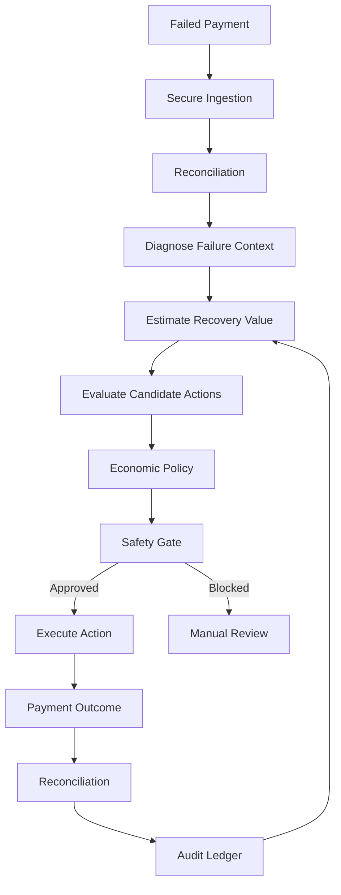
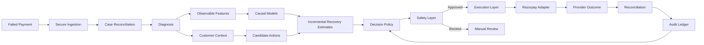
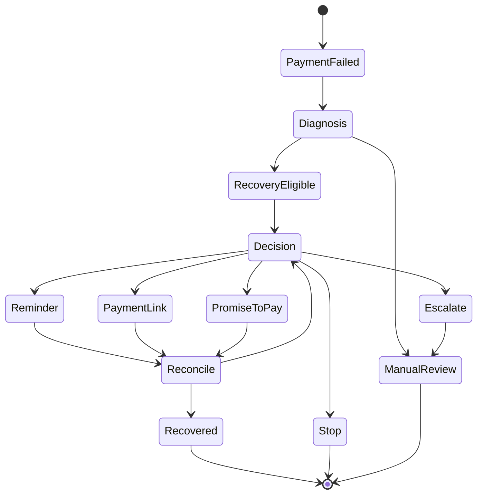
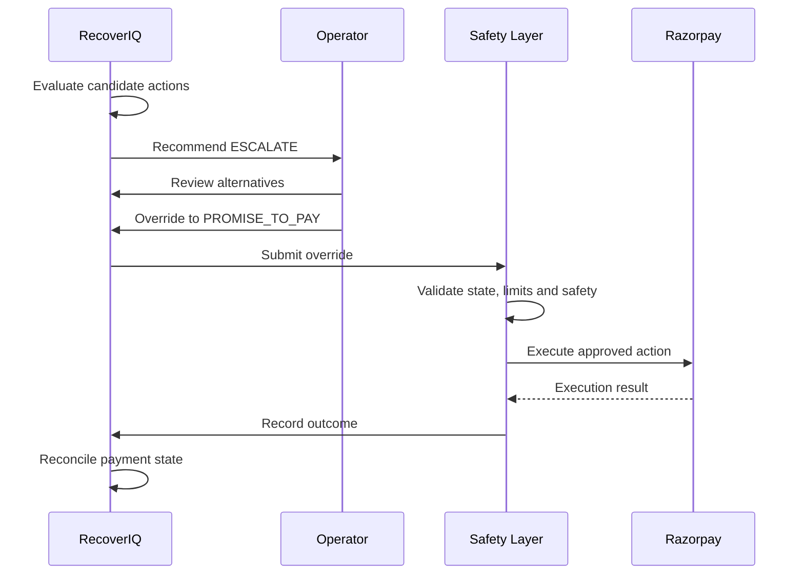
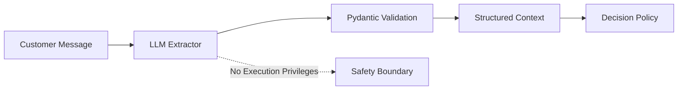
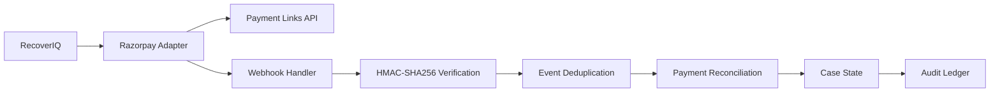
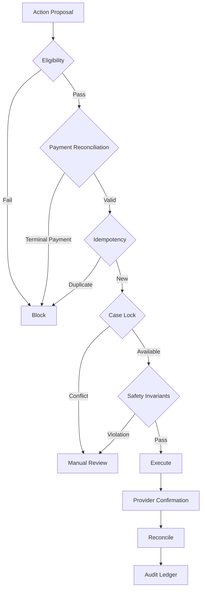
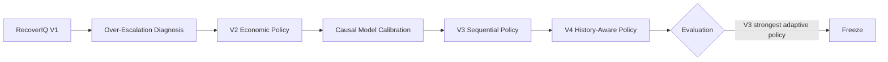
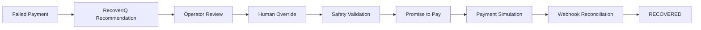

# RecoverIQ

## Adaptive Revenue Recovery Agent

RecoverIQ is an AI-powered revenue recovery agent for failed one-time payments.

It identifies payments at risk, understands the failure context, evaluates available recovery actions, and executes bounded recovery workflows while enforcing economic, operational, and safety constraints.

The system combines calibrated causal models, sequential decisioning, deterministic safety controls, payment reconciliation, customer-context extraction, and a Razorpay Test Mode integration.

> Built for Razorpay AI Buildathon 2026, Track 03: AI Revenue Recovery.

---

## Overview

Failed payments represent recoverable revenue, but indiscriminately retrying or escalating every case can increase customer friction and operational cost.

RecoverIQ treats recovery as a constrained decision problem:



Supported recovery actions include:

- Reminder
- Payment Link
- Promise to Pay
- Escalation
- Stop

Every automated action is subject to eligibility, timing, economic, state, and safety constraints.

---

## Core Architecture



### Separation of Responsibilities

RecoverIQ separates prediction, policy, execution, and safety.

> The model estimates incremental value.  
> The policy selects the action.  
> The safety layer authorizes execution.  
> The payment provider confirms the outcome.

The ML model and LLM never directly execute payment actions.

---

## Decision Pipeline

For every eligible failed payment, RecoverIQ estimates the incremental effect of candidate interventions.

Conceptually:

```text
Incremental Recovery
    = P(Recovery | Action)
    - P(Recovery | Control)
```

The economic layer then accounts for intervention cost and customer friction:

```text
Expected Net Value
    = Expected Incremental Recovery Value
    - Action Cost
    - Friction Cost
```

This allows the system to distinguish between:

- an action that recovers money anyway,
- an action that produces genuine incremental recovery,
- an action whose expected benefit does not justify its cost,
- and a case where taking no action is preferable.

---

## Autonomous Recovery Workflow



The system maintains bounded execution rules, including:

- Maximum automated actions
- Recovery-window limits
- Cooldown periods
- Active Promise-to-Pay protection
- Terminal payment-state protection
- Customer opt-out handling
- Idempotent execution
- Reconciliation before execution
- Case-level locking
- Ambiguous execution handling

---

## Human Override

RecoverIQ is autonomous by default, while human intervention remains available for exceptions and deliberate overrides.



Overrides do not bypass backend safety controls.

Every override records the selected action and operator justification in the audit trail.

---

## Customer Context and LLM Boundary

RecoverIQ can use an LLM for bounded customer-message context extraction.

The LLM is restricted to structured extraction such as:

- Payment intent
- Promise-to-Pay intent
- Requested payment date
- Customer constraints
- Relevant message context

The extracted output is validated against a strict Pydantic schema.



The LLM does not:

- Execute payment actions
- Authorize escalation
- Modify financial state
- Bypass safety controls
- Directly call the payment gateway

This boundary keeps language understanding separate from financial execution.

---

## Razorpay Integration

RecoverIQ includes a Razorpay Test Mode adapter for payment-link creation, webhook processing, reconciliation, and payment-state verification.



### Integration Controls

- Test Mode enforcement
- Fail-closed handling of live credentials
- HMAC-SHA256 webhook verification
- Raw-payload signature validation
- Event deduplication
- Idempotent execution
- Case-level mutual exclusion
- Pre-execution reconciliation
- Monotonic payment-state handling
- Structured audit logging

The repository uses Razorpay Test Mode for integration and demonstration. No production payment credentials or live transactions are required.

---

## Safety Architecture

Safety is implemented as a separate execution boundary rather than being delegated to the model.



### Failure Containment

The system includes controlled failure-injection scenarios covering areas such as:

- Duplicate execution
- Concurrent execution
- Stale payment state
- Webhook ordering
- Reconciliation failures
- Ambiguous provider outcomes
- Action-limit violations
- Invalid state transitions

When execution state is ambiguous, the system fails closed and moves the case toward manual review rather than assuming success.

---

## Evaluation Methodology

RecoverIQ was evaluated against three arms:

### Control

No recovery outreach.

### Deterministic Baseline

A strong rule-based recovery policy operating under the same action, timing, cost, and safety constraints.

### RecoverIQ

The adaptive causal recovery policy.

The evaluation uses synthetic cases with hidden potential outcomes. The agent only receives observable information available at decision time.

This prevents the decision policy from accessing ground-truth counterfactual outcomes.

---

## Frozen Phase 9 Benchmark

The authoritative 20,000-case benchmark produced the following results:

| Evaluation Arm | Mean Net Recovery / Case | Gross Recovered | Net Recovered | Recovery Rate |
|---|---:|---:|---:|---:|
| Control | ₹1,436.40 | ₹9.58M | ₹9.58M | 50.6% |
| RecoverIQ | ₹1,962.75 | ₹13.44M | ₹13.08M | 67.8% |
| Deterministic Baseline | ₹2,443.95 | ₹16.39M | ₹16.29M | 84.2% |

### Statistical Comparison

The benchmark used 2,000 bootstrap iterations with 95% confidence intervals.

**RecoverIQ vs Control**

```text
+₹526.36 net recovery per case
95% CI: [+₹437.09, +₹616.16]
```

The improvement over control is statistically significant.

**RecoverIQ vs Deterministic Baseline**

```text
-₹481.20 net recovery per case
95% CI: [-₹577.10, -₹383.87]
```

The deterministic baseline remains stronger in this simulator.

This result is intentionally retained rather than hidden.

---

## What the Benchmark Taught Us

The deterministic baseline benefits from a strong sequential waterfall strategy.

Low-cost interventions can be attempted before escalation, allowing the baseline to exploit the simulator's response structure while keeping intervention costs low.

Several adaptive policy iterations were evaluated, including:

- Economic thresholding
- Escalation-margin policies
- Calibrated causal models
- Sequential continuation-value decisioning
- History-aware policies

The strongest adaptive policy, V3, significantly improved over earlier RecoverIQ policies and substantially reduced unnecessary escalation, but it did not surpass the deterministic baseline.

Rather than overfit the simulator to force a favorable result, the project preserves the benchmark and documents the failure mode.

This became an important engineering finding:

> A one-step adaptive policy can underestimate the value of sequential recovery when future intervention opportunities are available.

---

## Adaptive Policy Evolution



The development process was intentionally iterative.

The main finding was that sequential recovery creates option value.

A policy that evaluates only immediate action value can prefer an expensive escalation, while a deterministic waterfall can obtain higher total recovery by trying cheaper interventions first.

---

## Verification

The repository contains automated verification covering domain logic, policy behavior, execution safety, reconciliation, integrations, and failure containment.

Run the complete test suite:

```bash
python -m pytest tests/ -v
```

Latest verified result:

```text
111 / 111 tests passing
```

Razorpay Test Mode integration can also be exercised with:

```bash
python scripts/run_razorpay_demo.py
```

---

## Demo Flow

The included demo case demonstrates the complete recovery lifecycle.



The demo demonstrates four core properties:

1. Autonomous decisioning
2. Economic reasoning
3. Human override
4. Safety-controlled execution

---

## Repository Structure

```text
recoveriq/
│
├── domain/
│   ├── models
│   ├── state machines
│   └── enums
│
├── models/
│   ├── feature pipeline
│   ├── incremental models
│   └── calibration artifacts
│
├── policy/
│   ├── adaptive policies
│   └── decision logic
│
├── execution/
│   ├── case locking
│   ├── reservations
│   └── idempotency
│
├── ingestion/
│   └── webhook/event processing
│
├── reconciliation/
│   └── payment-state reconciliation
│
├── safety/
│   ├── safety invariants
│   └── failure injection
│
├── integrations/
│   └── razorpay/
│       ├── client
│       ├── payment links
│       ├── webhooks
│       └── reconciliation
│
├── llm/
│   ├── extraction schemas
│   ├── prompts
│   └── context resolution
│
├── baseline/
│   └── deterministic baseline
│
├── simulator/
│   └── synthetic evaluation environment
│
├── evaluation/
│   └── benchmark and statistical evaluation
│
├── frontend/
│   └── React + TypeScript operations console
│
├── scripts/
│   ├── training
│   ├── evaluation
│   └── integration demos
│
├── docs/
│   ├── architecture
│   ├── implementation
│   ├── benchmark audits
│   └── demo documentation
│
├── results/
│   └── frozen evaluation artifacts
│
├── tests/
│
├── server.py
├── requirements.txt
├── .env.example
├── .gitignore
└── README.md
```

---

## Technology Stack

### Backend

- Python
- FastAPI
- Pydantic
- Scikit-learn
- LightGBM
- Pytest

### Frontend

- React
- TypeScript
- Vite
- Tailwind CSS
- Recharts
- Lucide
- Anime.js

### Payments

- Razorpay Test Mode
- Payment Links API
- Webhooks
- HMAC-SHA256 verification

### AI and ML

- Calibrated causal models
- T-Learner based incremental modeling
- Sequential decision policies
- Structured LLM extraction
- Pydantic schema validation

---

## Quick Start

### 1. Clone the repository

```bash
git clone https://github.com/<your-username>/RecoverIQ.git
cd RecoverIQ
```

### 2. Install backend dependencies

```bash
pip install -r requirements.txt
```

### 3. Configure the environment

```bash
copy .env.example .env
```

Configure Razorpay Test Mode credentials only if Razorpay integration testing is required.

Never commit `.env` or production credentials.

### 4. Install frontend dependencies

```bash
cd frontend
npm install
npm run build
cd ..
```

### 5. Start RecoverIQ

```bash
python server.py
```

Open:

```text
http://127.0.0.1:8000
```

---

## Documentation

Additional engineering documentation is available in [`docs/`](docs/).

Key documents include:

- [Architecture](docs/ARCHITECTURE.md)
- [Implementation](docs/IMPLEMENTATION.md)
- [Demo Script](docs/DEMO_SCRIPT.md)
- [Product Requirements](docs/PRD.md)
- [Phase 9 Corrected Report](docs/PHASE9_CORRECTED_REPORT.md)
- [Phase 10 Final Audit](docs/PHASE10_FINAL_AUDIT.md)
- [Phase 10 Implementation](docs/PHASE10_IMPLEMENTATION.md)

---

## Engineering Principles

### Backend Authority

The frontend never determines financial state.

### Safety Before Execution

Every action passes through backend safety controls before execution.

### Prediction Is Not Authorization

ML and LLM components provide information to the decision layer. They do not directly execute financial actions.

### Reconciliation Is Authoritative

Provider state is reconciled before and after critical execution paths.

### Fail Closed

Ambiguous or unsafe execution states are not treated as successful.

### Measure Outcomes

Recovery decisions are evaluated using economic outcomes rather than raw intervention volume.

### Preserve Negative Results

Benchmark results are retained even when an adaptive policy underperforms the deterministic baseline.

---

## Security Notes

RecoverIQ is a prototype implementation developed for the Razorpay AI Buildathon.

It should not be interpreted as a production financial system, security certification, or compliance certification.

The project intentionally separates:

- Synthetic evaluation data
- Razorpay Test Mode integration
- Application state
- Model artifacts
- Production credentials

Production credentials must never be committed to the repository.

---

## Buildathon

**Razorpay AI Buildathon 2026**

**Track 03: AI Revenue Recovery**

RecoverIQ explores how autonomous agents can recover failed-payment revenue while remaining economically bounded, auditable, and safe to execute.

The project focuses on a practical question:

> Can an AI recovery agent make economically meaningful recovery decisions without turning financial execution into an uncontrolled black box?

---

## License

Add the appropriate project license before public release.